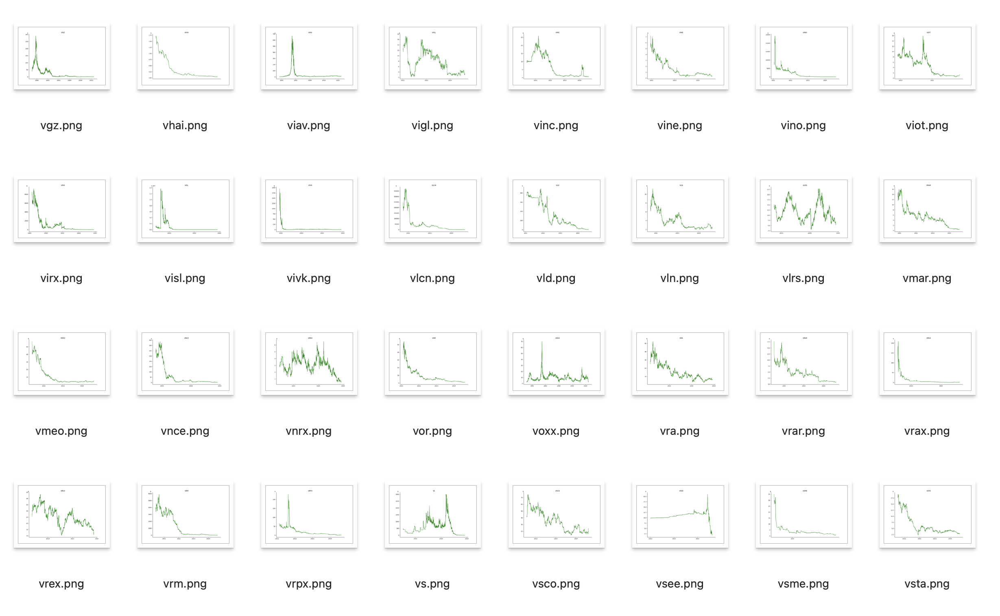

# stock-classify



This is a data science project that performs binary classification on all US stocks. The goal is to compare traditional machine learning approach and deep learning approach for time series classification.

A stock ticket is labeled as "1" (positive) if its price have "fallen to the ground", whatever that means, and labeled as "0" (negative) otherwise. Such low price stocks are very risky. But price patterns can be very diverse, so it is difficult to filter such stocks by any fixed rule. We manually labeled 414 positive tickets and 616 negative tickets that are randomly chosen from a pool of 6000+ tickets, for a total of 1030 labeled tickets. Labels are stored in the `label.json` file.

## Workflow
### setup
download the repository, create a new python envrionment, and install dependencies.
```shell
pip install -r requirements.txt
```

### I.data
① download historical day-level price data for all US stocks. The list of tickets (`data/tickets.txt`) comes from nasdaq, and may not be 100% complete or up-to-date.
```shell
cd data
python download.py
```
Each ticket history will be downloaded as a separate csv file in `data/csv` folder. You can use `--num=1000` flag to download data for only certain number of tickets at a time.

② plot all the data.
```shell
python plot.py
```
The plots will be saved in the `data/plots` folder.

---

### II.machine learning
① extract features from data 
```shell
cd ml
python extract_features.py
```
the output will be two csv tables in the `ml` folder, one for labeled tickets and one for unlabeled tickets.

② fit model
```shell
python fit.py --model=lr
```
Available models:
- `--model=lr` for logistic regression (default)
- `--model=tree` for decision trees
- `--model=boost` for gradient boosting

You should be able to get around 95% test accuracy. Model file will be saved as `model.pkl` in the same folder.

③ classify 5000+ unlabeled tickets
```shell
python pred.py
```
Prediction will be saved to a `prediction.json` file.
 
---

### III.deep learning
① prepare data for training with
```shell
cd cnn
python prepare.py
```
The output is two csv files "training_data.csv" and "unlabeled_data.csv" in the `cnn` folder.

② train the model with
```shell
python train.py
```
[wandb](https://wandb.ai/) is used for logging with project name "stock-cls", so before training please create an account and login. Otherwise, you can comment out the logger variable in `train.py`. After training, model weights will be saved to `cnn/stock-cls/[some-name]/checkpoints/` folder.

③ classify unlabeled tickets with
```shell
python pred.py
```
The output will be a `prediction.json` file in the `cnn` folder.

## Remarks
**point 0. defining the problem is often hard.** 

If you have a _precise_ definition of your problem, then you already solved it. There are so many known and unknown variations that we deem should be of the same category, that's why we label data. If you are a client-facing consultant, you'll find that clients often don't know what they want, until you show them your work. In such situation, it is important to encourage clients to clarify their needs early on.

**point 1. no feature can perfectly distinguish classes.** 

Otherwise, this single feature can be used as a classifier. For consistency, it is recommended for all features to have the same scaling, for example in range $[0,1]$. The goal is to find features $f:X\to[0,1]$ such that class-0 data map to values close to $0$, class-1 data map to values close to $1$, with as little overlap as possible. The more such features we find, the easier for machine learning models to separate, because the distance between $\mathbf{0}=(0,\ldots,0)$ and $\mathbf{1}=(1,\ldots,1)$ in $\mathbb{R}^n$ is $\sqrt{n}$ and it goes to infinity as $n\to\infty$. Features should also be independent from each other, because dependence reduces effectiveness.

**point 2. machine learning approach is very explainable.** 

During feature selection, it is even possible to discover labeling errors in data by examining individual features, which is something that is not very possible with deep learning approach. When the ML model works well, you know exactly why it works. You solved the problem with human intelligence. The whole process is transparent.

**point 3. deep learning is powerful but hard to control.**

Deep learning models have powerful representations, you can instantly achieve high accuracy without going through feature engineering. However, setting up and training neural networks is a heavy process, which means it is less flexible when you want to update or change something later. Training can be very unstable and volatile, and model performance is sensitive to hyperparameters. Yet hyperparameter tuning wouldn't give you much insights to your original problem. 